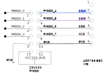

.. _template_project:

Project template
================================================================================

Overview
-------------------------------------------------------------------------------

**\*Some specifications about the board, the chip, etc. Typically the
information found on the** https://www.analog.com/en/products/
**website**\ \*

Supported devices
-------------------------------------------------------------------------------

**\*IF IT APPLIES**\ \*

Supported carriers
-------------------------------------------------------------------------------

**\*At least one. Should be updated each time the project is ported to
another carrier**\ \*

Block design
-------------------------------------------------------------------------------

Block diagram
~~~~~~~~~~~~~~~~~~~~~~~~~~~~~~~~~~~~~~~~~~~~~~~~~~~~~~~~~~~~~~~~~~~~~~~~~~~~~~~

\**\* MUST HAVE \**\* The data path and clock domains are depicted in
the below diagram:

\*\* TIP: upload the .svg file for the diagram to have high quality \*\*

.. image:: ../images/ad9783_zcu102_block_diagram.svg
   :width: 800
   :align: center
   :alt: AD9783-EBZ/ZCU102 block diagram

Clock scheme **\*IF IT APPLIES**\ \*
~~~~~~~~~~~~~~~~~~~~~~~~~~~~~~~~~~~~~~~~~~~~~~~~~~~~~~~~~~~~~~~~~~~~~~~~~~~~~~~

-  External clock source
   :dokuwiki:`AD-SYNCHRONA14-EBZ <resources/eval/user-guides/ad-synchrona14-ebz>`
-  SYSREF clocks are LVDS
-  ADCCLK and REFCLK are LVPECL

\*\* ADD IMAGE IF APPLIES! TIP: upload the .svg file for the diagram to have
high quality \*\*

Description of components
~~~~~~~~~~~~~~~~~~~~~~~~~~~~~~~~~~~~~~~~~~~~~~~~~~~~~~~~~~~~~~~~~~~~~~~~~~~~~~~

**\*OTHER COMPONENTS FROM THE PROJECT, EX: SYNCHRONA**\ \*

Only the channels presented in the clocking selection are relevant. For
the rest, you can either disable them or just put a divided frequency of
the source clock.

Configurations
^^^^^^^^^^^^^^^^^^^^^^^^^^^^^^^^^^^^^^^^^^^^^^^^^^^^^^^^^^^^^^^^^^^^^^^^^^^^^^^

Limitations
^^^^^^^^^^^^^^^^^^^^^^^^^^^^^^^^^^^^^^^^^^^^^^^^^^^^^^^^^^^^^^^^^^^^^^^^^^^^^^^

**\*EXAMPLE OF CONFIGURATION/LIMITATION. PLEASE WRITE THIS KIND OF
INFORMATION IF IT APPLIES TO THE PROJECT**\ \*

The design has one JESD receive chain with 4 lanes at rate of 13Gbps.
The JESD receive chain consists of a physical layer represented by an
XCVR module, a link layer represented by an RX JESD LINK module and
transport layer represented by a RX JESD TPL module. The link operates
in Subclass 1.

The link is set for full bandwidth mode and operate with the following
parameters:

Deframer paramaters: L=4, M=2, F=1, S=1, NP=16

| SYSREF - 5.078125 MHZ
| REFCLK - 325MHz (Lane Rate/40)
| DEVICECLK - 325 MHz
| ADCCLK - 1300MHz
| JESD204B Lane Rate - 13Gbps

The transport layer component presents on its output 128 bits at once on
every clock cycle, representing 4 samples per converter. The two receive
chains are merged together and transferred to the DDR with a single DMA.

IP list
~~~~~~~~~~~~~~~~~~~~~~~~~~~~~~~~~~~~~~~~~~~~~~~~~~~~~~~~~~~~~~~~~~~~~~~~~~~~~~~

\**\* THIS IS JUST AN EXAMPLE \**\*

-  :git-hdl:`AXI_AD4858 <master:library/axi_ad4858>`
-  :git-hdl:`AXI_PWM_GEN <master:library/axi_pwm_gen>`
-  :git-hdl:`AXI_CLKGEN <master:library/axi_clkgen>`
-  :git-hdl:`AXI_DMAC <master:library/axi_dmac>`
-  :git-hdl:`UTIL_UPACK2 <master:library/util_pack/util_upack2>`
-  :git-hdl:`UTIL_CPACK2 <master:library/util_pack/util_cpack2>`

I2C connections
~~~~~~~~~~~~~~~~~~~~~~~~~~~~~~~~~~~~~~~~~~~~~~~~~~~~~~~~~~~~~~~~~~~~~~~~~~~~~~~

SPI connections
~~~~~~~~~~~~~~~~~~~~~~~~~~~~~~~~~~~~~~~~~~~~~~~~~~~~~~~~~~~~~~~~~~~~~~~~~~~~~~~

GPIOs
~~~~~~~~~~~~~~~~~~~~~~~~~~~~~~~~~~~~~~~~~~~~~~~~~~~~~~~~~~~~~~~~~~~~~~~~~~~~~~~

CPU/Memory interconnects addresses
~~~~~~~~~~~~~~~~~~~~~~~~~~~~~~~~~~~~~~~~~~~~~~~~~~~~~~~~~~~~~~~~~~~~~~~~~~~~~~~

\**\* THIS IS JUST AN EXAMPLE \**\*

=========== ==========
Instance    Address
=========== ==========
axi_ad4858  0x43c00000
axi_pwm_gen 0x43d00000
ad4858_dma  0x43e00000
adc_clkgen  0x44000000
=========== ==========

Interrupts
~~~~~~~~~~~~~~~~~~~~~~~~~~~~~~~~~~~~~~~~~~~~~~~~~~~~~~~~~~~~~~~~~~~~~~~~~~~~~~~

Below are the Programmable Logic interrupts used in this project.

.. dropdown:: Interrupts table

   You have two ways of writing this table: as a list-table or really to draw
   it. Take a look in the .rst of this page to see how they're written and
   which suits best your case.

   .. list-table::
      :widths: 30 10 15 15 15 15
      :header-rows: 1

      * - Instance name
        - HDL
        - Linux Zynq
        - Actual Zynq
        - Linux ZynqMP
        - Actual ZynqMP
      * - ---
        - 15
        - 59
        - 91
        - 111
        - 143
      * - ---
        - 14
        - 58
        - 90
        - 110
        - 142
      * - ---
        - 13
        - 57
        - 89
        - 109
        - 141
      * - ---
        - 12
        - 56
        - 88
        - 108
        - 140
      * - ---
        - 11
        - 55
        - 87
        - 107
        - 139
      * - ---
        - 10
        - 54
        - 86
        - 106
        - 138
      * - ---
        - 9
        - 53
        - 85
        - 105
        - 137
      * - ---
        - 8
        - 52
        - 84
        - 104
        - 136
      * - ---
        - 7
        - 36
        - 68
        - 96
        - 128
      * - ---
        - 6
        - 35
        - 67
        - 95
        - 127
      * - ---
        - 5
        - 34
        - 66
        - 94
        - 126
      * - ---
        - 4
        - 33
        - 65
        - 93
        - 125
      * - ---
        - 3
        - 32
        - 64
        - 92
        - 124
      * - ---
        - 2
        - 31
        - 63
        - 91
        - 123
      * - ---
        - 1
        - 30
        - 62
        - 90
        - 122
      * - ---
        - 0
        - 29
        - 61
        - 89
        - 121

   ============= === ========== =========== ============ =============
   Instance name HDL Linux Zynq Actual Zynq Linux ZynqMP Actual ZynqMP
   ============= === ========== =========== ============ =============
   ---           15  59         91          111          143
   ---           14  58         90          110          142
   ---           13  57         89          109          141
   ---           12  56         88          108          140
   ---           11  55         87          107          139
   ---           10  54         86          106          138
   ---           9   53         85          105          137
   ---           8   52         84          104          136
   ---           7   36         68          96           128
   ---           6   35         67          95           127
   ---           5   34         66          94           126
   ---           4   33         65          93           125
   ---           3   32         64          92           124
   ---           2   31         63          91           123
   ---           1   30         62          90           122
   ---           0   29         61          89           121
   ============= === ========== =========== ============ =============

**\*These are the project-specific interrupts (usually found in
/project_name/common/Project_name_bd,tcl).
Add the name of the component that uses that interrupt.
Use a hidden section so this page won't get to be kilometers
long.\\\\**\ \*

Building the HDL project
-------------------------------------------------------------------------------

**\*YOU CAN KEEP THE FIRST PARAGRAPH SINCE IT IS GENERIC**\ \*

The design is built upon ADI's generic HDL reference design framework.
ADI does not distribute the bit/elf files of these projects so they
must be built from the sources available :git-hdl:`here <master:/>`. To get
the source you must
`clone <https://git-scm.com/book/en/v2/Git-Basics-Getting-a-Git-Repository>`__
the HDL repository.

Then go to the **\*PROJECT LOCATION WITHIN HDL (EX:
projects/ad9695/zcu102)**\ \* location and run the make command by
typing in your command prompt:

**Linux/Cygwin/WSL**

**\*Say which is the default configuration that's built when running
``make``, give examples of running with all parameters and also with
just one. Say that it will create a folder with the name ... when
running with the following parameters.**\ \*

.. code-block::

   user@analog:~$ cd hdl/projects/cn0577/zed
   user@analog:~/hdl/projects/cn0577/zed$ make TWOLANES=0

It will create a folder called ``TWOS`` because the script that builds
the project, removes the strings "JESD" and "LANE" from the
parameter's name because Linux has a maximum path length of 260
characters.
**\*KEEP THIS LINE TOO**\ \* Check `this
guide <resources/tools-software/linux-software/kuiper-linux>`__ on
how to prepare your SD card with the proper boot files.
A more comprehensive build guide can be found in the :ref:`build_hdl` user guide.

Setup guide
-------------------------------------------------------------------------------

**\* Upload a picture of what your setup looks like.
Attention: hide board labels (e.g., from AssetTiger) and other
information that is ADI internal only.**\ \*

\**\* PLESE KEEP THIS WHOLE SECTION AND ADAPT IT TO YOUR PROJECT,
ESPECIALLY IF YOU HAVE EXTERNAL CLOCKS OR OTHER SIGNALS \**\*

Hardware requirements
~~~~~~~~~~~~~~~~~~~~~~~~~~~~~~~~~~~~~~~~~~~~~~~~~~~~~~~~~~~~~~~~~~~~~~~~~~~~~~~

\**\* MENTION THESE \**\*

-  Boards and PMODs used
-  Cables and their type
-  1x SD card (at least 16GB); follow :dokuwiki:`this
   guide <resources/tools-software/linux-software/kuiper-linux>`
-  Power supplies
-  Other add-ons, etc.

**\*THIS IS JUST AN EXAMPLE**\ \*

-  :part:`AD9695-1300EBZ <AD9695>`
-  :xilinx:`ZCU102 <ZCU102>`
-  :dokuwiki:`AD-SYNCHRONA14-EBZ <resources/eval/user-guides/ad-synchrona14-ebz>`
-  :part:`ADALM2000 (M2K) <ADALM2000>`
-  :dokuwiki:`ADALM2000 BNC adapter
   board <university/tools/m2k/accessories/bnc>`
-  5x SMA to SMA cable
-  Ethernet cable
-  1x SD card (at least 16GB); follow :dokuwiki:`this
   guide <resources/tools-software/linux-software/kuiper-linux>`
-  3x 50 Ohm DC to 12Ghz SMA Termination
-  VADJ of Zedboard must be set to **2.5V**
-  Jumpers P1 and P2 must be put in (1,2) position
-  Power supply of 12V for the carrier

Connections and hardware changes
~~~~~~~~~~~~~~~~~~~~~~~~~~~~~~~~~~~~~~~~~~~~~~~~~~~~~~~~~~~~~~~~~~~~~~~~~~~~~~~

.. warning::

   Please pay attention to the following hardware changes!

\**\* MENTION THESE \**\*

-  For ZCU102:

   -  VADJ must be set to **1.8** (default one)
   -  SW6 must be put in (1:ON, 2:OFF, 3:OFF, 4:OFF) position to be able
      to boot from SD card

-  What VADJ to be used for each type of setup
-  How the jumpers/switches should be set on the board/carrier
-  On which FMC port should the board be placed
-  Other changes to the board and the carrier
-  AD9695 connected to ZCU102 on FMC HPC1

.. list-table::
   :widths: 50 50
   :header-rows: 1

   * - ZCU102
     - Synchrona
   * - J79
     - CH2_P
   * - J80
     - CH2_N

Putting everything together
~~~~~~~~~~~~~~~~~~~~~~~~~~~~~~~~~~~~~~~~~~~~~~~~~~~~~~~~~~~~~~~~~~~~~~~~~~~~~~~

\**\* PLESE KEEP THIS WHOLE PARAGRAPH AND ADAPT IT TO YOUR PROJECT \**\*
After having all the **Connections and hardware changes** done properly as
mentioned in the previous section, you may continue with the following steps:

**\*THIS IS JUST AN EXAMPLE**\ \*

#. Attach :part:`EVAL-AD9783` to ZCU102 FMC0 connector using the
   :part:`AD-DAC-FMC`-ADP adapter board
#. Connect a 5 wire cable from :part:`EVAL-AD9783`'s **XP3** to
   :xilinx:`ZCU102`'s **PMOD0** (see pinout from the photo below):
   |ad9783_zcu102_spi_pmod.svg|
#. Prepare the SD card

   #. Prepare the latest Linux image from :dokuwiki:`this
      guide <resources/tools-software/linux-software/kuiper-linux>`
   #. From zynqmp-common folder of the boot partition, copy the Image file
      into the root folder of the partition
   #. From zynqmp-zcu102-rev10-ad9783 folder of the boot partition, copy the
      system.dtb and BOOT.BIN files into the root folder of the partition

#. Insert the SD card into the :xilinx:`ZCU102` SD card slot
#. Connect clock source for the clock input at J1 on the evaluation board via
   an SMA cable, and DAC output at J5 (IOUT1P) or J9 (IOUT2P) via an SMA cable
   to a spectrum analyzer
#. Connect the UART port on the FPGA via USB Micro-B to PC
#. Set the clock input to 500MHz, +3dBm
#. Connect the evaluation board to a 5Vdc 1A power supply on P5 and P6
#. Power on the evaluation board, clock generator and FPGA
#. Write the EEPROM found on the :part:`AD-DAC-FMC`-ADP to set the VADJ to
   1.8V, using the tutorial
   :dokuwiki:`<resources/eval/user-guides/ad-fmcomms1-ebz/software/linux/applications/fru_dump>`.
   The file you will write on the EEPROM, can be found on the
   `ADI fru_tools <https://github.com/analogdevicesinc/fru_tools>`__ GitHub
   repository: download the **AD9783-DPG2-EBZ.bin** file from *masterfiles*
   folder onto your SD card.

Troubleshooting
~~~~~~~~~~~~~~~~~~~~~~~~~~~~~~~~~~~~~~~~~~~~~~~~~~~~~~~~~~~~~~~~~~~~~~~~~~~~~~~

\**\* PLESE KEEP THIS WHOLE PARAGRAPH AND ADAPT IT TO YOUR PROJECT \**\*

**\*THIS IS JUST AN EXAMPLE**\ \*

#. Check if the voltage supply test points of the evaluation board has the
   correct value
#. Check if all (3) blue LEDs on the :part:`AD-DAC-FMC`-ADP board are lit up.
   Reconnect the board to the FMC connector of the carrier if not lit up
#. Check if the carrier is being supplied properly
#. Check on the Spectrum Analyzer if the DAC clock inputs are properly driven.
   If not detected, check properly the clock source and connection

Resources
-------------------------------------------------------------------------------

\**\* MENTION THESE \**\*

-  Link to the project source code
-  Links to the wiki documentation of the IPs that are used in this
   project
-  Links to the Linux driver and devicetree source code and wiki
   documentation
-  Links to the datasheets/schematics of the boards used in this wiki
   page

More information
-------------------------------------------------------------------------------

-  :ref:`ADI HDL User guide <user_guide>`
-  :ref:`ADI HDL project architecture <architecture>`
-  :ref:`ADI HDL project build guide <build_hdl>`
-  Other relevant information

\**\* THIS IS JUST AN EXAMPLE \**\*

-  :dokuwiki:`EVALUATING THE AD9695/AD9697 ANALOG-TO-DIGITAL
   CONVERTER <resources/eval/ad9695-1300ebz>`
-  :dokuwiki:`AD-SYNCHRONA14-EBZ <resources/eval/user-guides/ad-synchrona14-ebz>`
-  :dokuwiki:`Generic JESD204B block
   designs <resources/fpga/docs/hdl/generic_jesd_bds>`
-  :dokuwiki:`JESD204B High-Speed Serial Interface
   Support <resources/fpga/peripherals/jesd204>`
-  :dokuwiki:`AXI_PWM_GEN <resources/fpga/docs/axi_pwm_gen>` wiki documentation
-  :dokuwiki:`AXI_CLKGEN <resources/fpga/docs/axi_clkgen>` wiki documentation
-  :dokuwiki:`High-Speed DMA Controller
   Peripheral <resources/fpga/docs/axi_dmac>` wiki documentation
-  :dokuwiki:`UTIL_CPACK2 <resources/fpga/docs/util_cpack2>` wiki documentation
-  :dokuwiki:`UTIL_UPACK2 <resources/fpga/docs/util_upack2>` wiki documentation
-  :dokuwiki:`How to prepare an SD
   card <resources/tools-software/linux-software/kuiper-linux>` with
   boot files
-  :dokuwiki:`ADI reference designs HDL user guide <resources/fpga/docs/hdl>`
-  :dokuwiki:`ADI HDL architecture <resources/fpga/docs/arch>` wiki page
-  :dokuwiki:`How to build an ADI HDL project <resources/fpga/docs/build>`
-  :ref:`ADI HDL User guide <user_guide>`
-  :ref:`ADI HDL project architecture <architecture>`
-  :ref:`ADI HDL project build guide <build_hdl>`

Support
-------------------------------------------------------------------------------

Analog Devices will provide **limited** online support for anyone using
the reference design with Analog Devices components via the
:ez:`fpga` FPGA reference designs forum.

It should be noted, that the older the tools' versions and release
branches are, the lower the chances to receive support from ADI
engineers.

